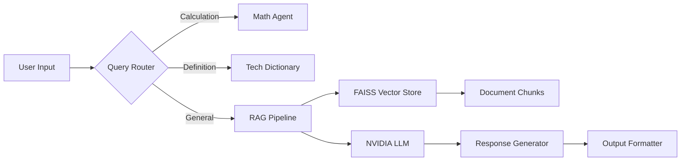

# RAG Knowledge Assistant


A multi-agent Q&A system combining NVIDIA's cutting-edge LLMs with Retrieval-Augmented Generation (RAG) for enterprise knowledge management.

## Table of Contents
- [Architecture](#architecture)
- [Features](#features)
- [Design Philosophy](#design-philosophy)
- [Installation](#installation)
- [Configuration](#configuration)
- [Usage](#usage)
- [Directory Structure](#directory-structure)
- [Dependencies](#dependencies)
- [Troubleshooting](#troubleshooting)
- [FAQ](#faq)
- [License](#license)

## Architecture



**Data Flow**:
1. User query analyzed by router
2. Specialized tools handle math/definition requests
3. General queries use RAG pipeline:
   - Retrieve top-3 relevant document chunks
   - Generate answer using NVIDIA Nemotron-ultra-253b-v1
4. Unified response formatting

## Features

- **Multi-Agent Routing**
  - Regex-based query classification
  - Calculator for arithmetic operations
  - Technical term dictionary
- **RAG Pipeline**
  - Local sentence-transformers embeddings
  - FAISS similarity search
  - NVIDIA API integration
- **Enterprise Security**
  - Document deserialization safety controls
  - Input sanitization
  - API key encryption support
- **Observability**
  - Context source visibility
  - Path decision logging
  - Error tracking

## Design Philosophy

| Principle              | Implementation                                                                 |
|------------------------|---------------------------------------------------------------------------------|
| Accuracy               | Hybrid local/cloud processing                                                  |
| Security               | Restricted deserialization, input validation                                   |
| Cost Efficiency        | Local embeddings + cloud LLM                                                   |
| Extensibility          | Modular agent architecture                                                     |
| Transparency           | Context sources display, decision logging                                      |

## Installation

### System Requirements
- Python 3.11+
- 4GB RAM minimum
- 500MB disk space

```bash
# Clone repository
git clone https://github.com/yourorg/nvidia-rag-assistant.git
cd nvidia-rag-assistant

# Create virtual environment
python -m venv .venv
source .venv/bin/activate  # Linux/MacOS
# .venv\Scripts\activate  # Windows

# Install dependencies
pip install -r requirements.txt
```

## Configuration

1. **API Setup**
```bash
# Set NVIDIA API key
export NVIDIA_API_KEY='nvapi-xxxxxxxx-xxxx-xxxx-xxxx-xxxxxxxxxxxx'
```

2. **Document Preparation**
```bash
mkdir -p docs
# Add your .txt files to docs/
# Supported format: UTF-8 text files under 1MB
```

## Usage

```bash
# Start application
streamlit run app.py

# Expected output:
# Local URL: http://localhost:8501
# Network URL: http://192.168.x.x:8501
```

**Example Workflow**:
1. Ask about product specs: "What's the screen resolution?"
2. Technical definition: "Define IP68 rating"
3. Policy question: "What's the return window?"
4. Calculation: "Compute 45*12+3"

## Directory Structure

```text
.
├── app.py               # Main application logic
├── docs/                # Document storage
│   ├── doc1.txt         # FAQ document
│   ├── doc2.txt         # Product specifications
│   └── doc3.txt         # Support contacts
├── faiss_index/         # Vector store (auto-generated)
├── requirements.txt     # Dependency manifest
└── README.md            # This document
```

## Dependencies

| Package                | Version  | Purpose                          |
|------------------------|----------|----------------------------------|
| streamlit              | 1.36.0   | Web interface                    |
| langchain-community    | 0.2.1    | Document processing              |
| sentence-transformers  | 2.6.0    | Local embeddings                 |
| openai                 | 1.30.1   | NVIDIA API client                |
| faiss-cpu              | 1.8.0    | Vector similarity search         |
| python-dotenv          | 1.0.1    | Environment management           |
| watchdog               | 4.0.0    | File system monitoring           |

## Troubleshooting

**Common Issues**:

| Symptom                      | Solution                                  |
|------------------------------|-------------------------------------------|
| FAISS load errors            | Delete faiss_index/ and restart           |
| XML tags in responses        | Upgrade openai package                    |
| Slow document processing     | Install watchdog: `pip install watchdog`  |
| API connection failures      | Verify NVIDIA_API_KEY environment variable|

**Debug Mode**:
```bash
DEBUG=true streamlit run app.py
```

## FAQ

**Q: How many documents can I process?**  
A: Tested with up to 100 docs (1MB each). For larger datasets, consider chunk size optimization.

**Q: Can I use my own LLM?**  
A: Yes - modify `generate_answer()` in app.py to support alternative providers.

**Q: Is my data sent to NVIDIA?**  
A: Only during answer generation - documents are processed locally.

**Q: How to improve accuracy?**  
A: 1. Clean document formatting 2. Adjust chunk_size/chunk_overlap 3. Modify system prompt

## License

Apache 2.0 License - See [LICENSE](LICENSE) for details.
